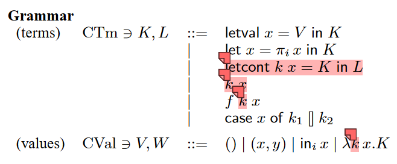

# Continuation-Passing Style

-  **First Class CPS**
-  **Second Class CPS**
-  **Compiling CPS**
-  **CPS With Excption**

--- 

# What is Continuation?

<v-click>

- Goto in C
- Basic Block with arguments in MLIR
- Call/CC in Scheme
- Second argument of (>>=) operator in Haskell
- RA register in RISC-V
</v-click>

<br>

<v-click>
<span v-mark.strike-through.red="3">Continuation is a function/closure</span>
</v-click>

<br>
<br>

<v-click>
Continuation is a representative of control flow
</v-click>
---

# First Class CPS

**Scheme provides the procedure call-with-current-continuation (also known as call/cc) to capture the current continuation by packing it up as an escape procedure bound to a formal argument in a procedure provided by the programmer.**
<br>
````md magic-move {lines: true}
```scheme
(define (find-first func lst)
  (call-with-current-continuation
   (lambda (return-immediately)
     (for-each (lambda (x)
		 (if (func x)
		     (return-immediately x)))
	  lst)
     #f)))
```
```scheme {2-3,6}
(define (find-first func lst)
  (call-with-current-continuation
   (lambda (return-immediately)
     (for-each (lambda (x)
		 (if (func x)
		     (return-immediately x)))
	  lst)
     #f)))
```
````
---

# Second Class CPS


-

- Definition of continuation
  - local continuation
  - return continuation in a function
- Use of continuation
  - local jump
  - callee return address

---

# Second Class CPS
## Example:
```c
int f() {
  int gRes = g(13);
  return gRes + 17;
}

int g(int x) {
  return x;
}
```

```haskell
let f kRet = 
  let kRA gRes = 
    kRet (gRes + 17) 
  in
  g kRA 13

let g kRet x = 
  kRet x
```

---

# Compiling CPS
- A continuation application k x corresponds to a **jump** (if k is a local continuation) or a **return** (if k is the return continuation of a function value).
- The expression f k x is the application of a function f to an argument x and a continuation k whose parameter receives the result of applying the function. If k is the return continuation for the nearest enclosing λ, then the application is a **tail call**.

1. <code>k x</code>: Local Jump
2. <code>kRet x</code>: Return
3. <code>g k x</code>: Call
4. <code>g kRet x</code>: Tail Call

---

# CPS With Excption


-
<v-click>
<div style="width: 360px;">

</div>
</v-click>
<v-click>
<div style="width: 350px;">

</div>
</v-click>
---

# CPS With Excption

- Now there are four possibilities for k: it may be a recursive or non-recursive occurrence of a letcont-bound continuation, compiled as a **jump**, it may be the **return** continuation, or it may be a handler continuation, which is interpreted as **raising an exception**.
- Function application f k h x includes a handler continuation argument h. If k is the return continuation for the nearest enclosing function, and h is its handler continuation, then the application is a **tail call**. If k is a local continuation and h is the handler continuation for the enclosing function, then the application is a **non-tail call without an explicit exception handler** – so exceptions are propagated to the context. Otherwise, h is an **explicit handler for exceptions raised by the function**.

1. <code>k x</code>: Local Jump
2. <code>kRet x</code>: Return
3. <code>kHandler x</code>: Raise
3. <code>g k kHandler x/g kRet h x</code>: Call without an explicit exception handler
4. <code>g k h x</code>: Call with an explicit handler for exceptions raised by the function
5. <code>g kRet kHandler x</code>: Tail Call

---

# Algebraic Effects

<div style="width: 400px;">

</div>
